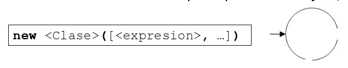
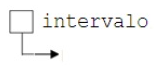
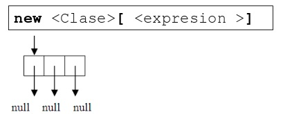

# Vista pública de los objetos

<div align=center>

|Creación|Referencia|Interacción|
|-|-|-|
Crear objetos|Referenciar objetos|Enviar mensajes
Creación de vectores de objetos|Referencia a un vector de referencias a objetos

</div>

---

## Creación de objetos

***new*** es un operador unario prefijo cuyo operando es una clase de objetos y **devuelve la dirección de memoria donde se ha reservado el espacio para dicho objeto**.

### Sintaxis f

```java
    new <Clase>([<expresion>, ...])
```

- La lista de expresiones debe coincidir con la lista de parámetros de alguno de los constructores de la clase
- En caso de no existir constructor, la lista debe estar vacía.

<div align=center>
    
</div>

```java
    new Intervalo()
    new Intervalo(100)
    new Intervalo(11.5, 55.1)
    new Intervalo(new Intervalo(-1, 1))
```

## Referencia a un objeto

Variable puntero que alberga la dirección de un objeto de una clase.

```java
    [final] <Clase> <referencia> [=<direccion>];
```

- A falta de inicialización, su dirección es **null**
- **final** obliga a la inicialización y fija su valor para la referencia.

```java
    Intervalo intervalo;
```

<div align=center>
    
</div>

### Operadores

|||
|-|-|
|`<referenciaO> = <direcciónO>`|Asigna la dirección a la referencia siendo del mismo tipo
|`<direcciónO-I> == <direcciónO-D>`|Determina si dos direcciones a objetos de la misma clase son iguales
|`<direcciónO-I> != <direcciónO-D>`|Determina si dos direcciones a objetos de la misma clase son distintas

```java
    final Intervalo HORARIO = new Intervalo(7, 15);
    Intervalo edades = new Intervalo(100);
    Intervalo años;
    años = edades;
    boolean mismo = edades == años;
```

## Paso de mensajes

```java
    <expression>.<methodName>([<expression>{, <expression>})]
```

Donde el método (sin contemplar constructores ni destructores) debe estar presente en la interfaz de la clase del objeto y la lista de expresiones debe coincidir en número y tipos a la lista de parámetros del método.

```java
    intervalo.longitud()
    new Intervalo(-100, 100).longitud()
    edades.partido(5)
    años.incluye(88)
    edades.interseccion(años)
```

## Creación de vectores de objetos

**new** es operador unario prefijo cuyo operando es un vector de referencias a objetos de una clase y devuelve la dirección de memoria donde se ha reservado el espacio para dicho vector.

### Sintaxis g

```java
    new <Clase>[<expresion >]
```

- La expresión debe ser de tipo entero y determina la longitud de referencias del vector inicializadas a **null**

<div align=center>
    
</div>

```java
    new Intervalo[100]
```


### Sintaxis h

```java
    new <Clase>[] { <expresion>, ..., <expresion> }
```

- Cada expresión debe ser una dirección a un objeto de la clase que inicializan las referencias del vector creado de longitud igual al número de expresiones;

```java
    Intervalo intervalo = new Intervalo();
    new Intervalo[] {new Intervalo(), null, intervalo)
```

<div align=center>


</div>


## Referencia a un vector de referencias a objetos

Es una variable puntero que alberga la dirección de un vector de referencias a objetos de una clase.

```java
    [final] <Clase>[] <referencia> [= <direccionVR>];
```

- Si no se inicializa, su dirección es **null**
- **final** obliga a la inicialización y fija el valor de la referencia

```java
    Intervalo[] intervalos;
    Intervalo[] intervalos = new Intervalo[10];
    intervalos[0] = new Intervalo ();
    intervalos[1] = intervalos[0].desplazados(1);
    intervalos[intervalos.length-1] = new Intervalo(2,2);
    Intervalo intervalo = intervalos[1];
    intervalos = null;
```
